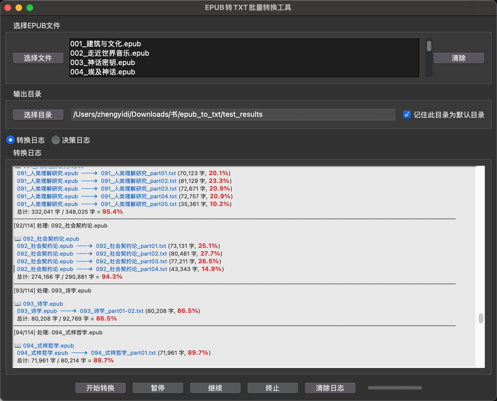

中文版 (For English version, please scroll down. ) 


# 📚 EPUB to TXT 智能批量转换工具

> **专为 AI 知识库构建打造的数据清洗工具**  
> 🧹 自动剔除无关信息 | ✂️ 智能长文切分 | 🚀 批量极速转换

这是一个专门为 LLM（大语言模型）和 RAG（检索增强生成）场景设计的 EPUB 处理工具。它不仅能将 `.epub` 批量转换为 `.txt`，还能智能剔除前言、译者序、后记等干扰信息，保留最纯净的正文内容，从而**节省 Token** 并**提升 AI 回答质量**。

特别针对 **NotebookLM** 等有字数/Token 上限的工具进行了优化，支持按章节语义智能切分超长书籍。

---

## ✨ 核心特性

*   **🧹 智能清洗**：自动识别并移除前言、后记、版权页等非正文内容，减少 AI 幻觉干扰。
*   **✂️ 语义切分**：针对 NotebookLM 等工具的上下文限制，支持**智能大文件切分**（按章节边界切分，保留语义完整性）。
*   **📦 批量处理**：一键扫描目录，自动处理成百上千本电子书。
*   **🖥️ 双模操作**：提供直观的 GUI 图形界面（小白推荐）和强大的命令行 CLI（极客首选）。
*   **📊 实时反馈**：转换过程中实时显示字数统计、压缩比率及进度条。

## 📸 界面预览





## 🛠️ 安装依赖

确保你的环境已安装 Python，然后运行：

```bash
pip install -r requirements.txt
```

---

## 🚀 使用方法

### 1. 🖥️ GUI 图形界面（推荐）

适合大多数用户的可视化操作模式。

```bash
python gui.py
```

**功能亮点：**
*   **📂 灵活选择**：支持多选文件或直接选择整个输入目录。
*   **💾 智能记忆**：勾选 `记住默认目录`，省去每次重复查找路径的麻烦。
*   **📝 详细日志**：
    *   直观展示 `原文件` → `生成文件` 的映射关系。
    *   **🔴 高亮显示**：重点标注处理进度百分比与状态。
    *   实时统计每本书的清洗后字数。

### 2. ⌨️ 命令行界面 (CLI)

适合自动化脚本或服务器部署。

**基础用法：**

```bash
# 转换当前目录下的所有 EPUB
python main.py

# 转换指定目录，并输出到其他位置
python main.py -d /path/to/epubs -o /path/to/output
```

**进阶用法：**

```bash
# 指定特定的几个文件
python main.py -f file1.epub file2.epub

# 🚫 仅转换格式，不进行文件切分（保持单一大文件）
python main.py --no-split
```

**参数说明：**

| 参数 | 简写 | 说明 |
| :--- | :--- | :--- |
| `--directory` | `-d` | 指定包含 EPUB 文件的源目录 |
| `--files` | `-f` | 指定具体的一个或多个文件路径 |
| `--output` | `-o` | 指定输出 TXT 的目标目录 |
| `--no-split` | | 禁用智能分片功能（默认开启） |

---

## 📂 项目结构

```text
epub_to_txt/
├── 📄 main.py                 # 🚀 程序入口 (CLI)
├── 🎨 gui.py                  # 🖥️ 图形界面入口
├── 🧩 epub_parser.py          # 核心解析器：提取文本与结构
├── 🔍 chapter_detector.py     # 正则规则库：识别目录与章节
├── ✂️ text_splitter.py        # 切分模块：计算字数与智能分片
├── ⚙️ epub_converter_config.json  # GUI 配置文件 (自动生成)
└── 📝 requirements.txt        # 项目依赖
```

## 🧠 模块详解

*   **`chapter_detector.py`**：内置大量正则表达式，能精准识别各种奇怪的章节标题格式。如果你发现某些书识别不准，请修改此处的 `_build_patterns()`。
*   **`text_splitter.py`**：负责计算 AI 友好的分片策略，确保切分后的文本块不会在章节中间断开。

## ⚠️ 注意事项

1.  **文件完整性**：损坏的 EPUB 文件可能会导致解析失败。
2.  **正则规则**：虽然我们覆盖了大多数书籍格式，但对于排版极其特殊的书籍，可能需要手动微调正则规则。
3.  **编码格式**：所有输出文件均强制使用 **UTF-8** 编码，确保跨平台兼容性。

## 📄 许可证

本项目采用 MIT 许可证。仅供个人学习与 AI 知识库构建使用。
```

---

# 📖 版本 2：英文版 (English)

适合发布到 GitHub 国际社区或作为双语文档的下半部分。

markdown
# 📚 EPUB to TXT Smart Batch Converter

> **The ultimate data cleaning tool for AI Knowledge Bases.**  
> 🧹 Auto-clean metadata | ✂️ Smart Splitting | 🚀 Batch Processing

This project is designed for users who need to process large collections of `.epub` ebooks into clean `.txt` format for **LLM (Large Language Model)** training or **RAG (Retrieval-Augmented Generation)** workflows.

It goes beyond simple conversion by automatically identifying and removing "noise" such as prefaces, translator notes, and postscripts—keeping only the core content to **save tokens** and **improve AI context quality**.

It is specifically optimized for tools with context limits like **NotebookLM**, offering smart semantic splitting based on word count while preserving chapter integrity.

---

## ✨ Key Features

*   **🧹 Smart Cleaning**: Automatically filters out prefaces, postscripts, and copyright pages to reduce hallucinations in AI responses.
*   **✂️ Semantic Splitting**: Smartly splits large books into smaller chunks based on word count limits (perfect for NotebookLM), ensuring cuts only happen at chapter boundaries.
*   **📦 Batch Processing**: Detects and converts all EPUB files in a directory instantly.
*   **🖥️ Dual Interface**: Includes a user-friendly **GUI** and a powerful **CLI** for advanced users.
*   **📊 Visual Stats**: Provides real-time word counts and progress tracking.

## 📸 Screenshot


## 🛠️ Installation

Ensure you have Python installed, then run:

```bash
pip install -r requirements.txt
```

---

## 🚀 Usage

### 1. 🖥️ GUI Mode (Recommended)

The easiest way to use the tool.

```bash
python gui.py
```

**GUI Highlights:**
*   **📂 Easy Selection**: Select multiple files or entire directories with one click.
*   **💾 Auto-Save Path**: Check `Remember Default Directory` to save your workflow settings.
*   **📝 Live Logs**:
    *   Visualizes `Source` → `Target` file mapping.
    *   **🔴 Highlighted** percentage indicators and status updates.
    *   Word count statistics for every converted file.

### 2. ⌨️ Command Line (CLI)

Ideal for scripts and automation.

**Basic Commands:**

```bash
# Convert all EPUBs in the current directory
python main.py

# Convert a specific directory and output to a new folder
python main.py -d /path/to/epubs -o /path/to/output
```

**Advanced Commands:**

```bash
# Convert specific files only
python main.py -f file1.epub file2.epub

# 🚫 Convert ONLY (Disable smart splitting)
python main.py --no-split
```

**Arguments:**

| Argument | Alias | Description |
| :--- | :--- | :--- |
| `--directory` | `-d` | Path to the directory containing EPUB files |
| `--files` | `-f` | Specific EPUB file paths to convert |
| `--output` | `-o` | Destination directory for TXT files |
| `--no-split` | | Disable the auto-splitting feature |

---

## 📂 Project Structure

```text
epub_to_txt/
├── 📄 main.py                 # 🚀 CLI Entry point
├── 🎨 gui.py                  # 🖥️ GUI Application
├── 🧩 epub_parser.py          # Core parser: Extracts text & structure
├── 🔍 chapter_detector.py     # Regex library: Identifies chapters
├── ✂️ text_splitter.py        # Logic: Word counting & semantic splitting
├── ⚙️ epub_converter_config.json  # User preferences (Auto-generated)
└── 📝 requirements.txt        # Dependencies
```

## 🧠 Module Overview

*   **`chapter_detector.py`**: Contains a robust set of Regex patterns to identify various chapter formats. If a specific book format isn't recognized, add your pattern to `_build_patterns()`.
*   **`text_splitter.py`**: Handles the logic for slicing text. It ensures that when a book is split (to fit AI context windows), the break occurs at the end of a chapter, not in the middle of a sentence.

## ⚠️ Notes

1.  **File Integrity**: Corrupted EPUB headers may cause conversion failures.
2.  **Custom Regex**: While the tool covers most formats, highly unconventional formatting may require manual adjustment in the regex module.
3.  **Encoding**: All output files are encoded in **UTF-8**.

## 📄 License

This project is for educational and personal use.
```
